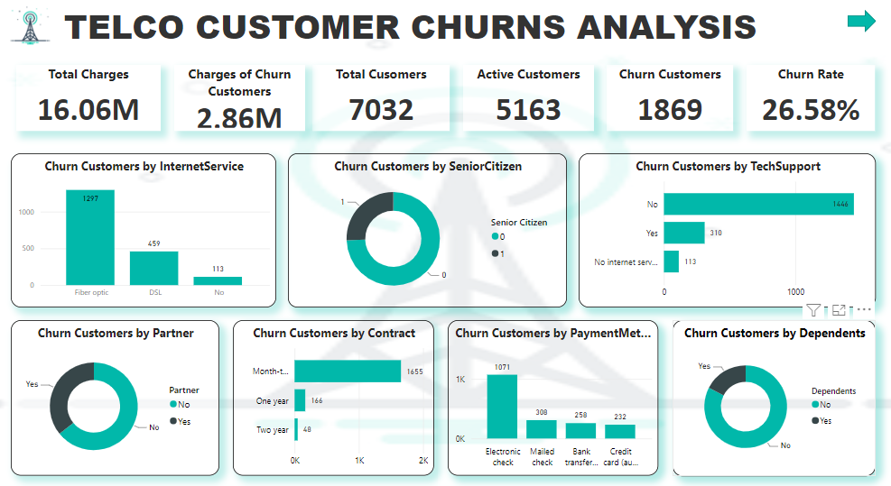
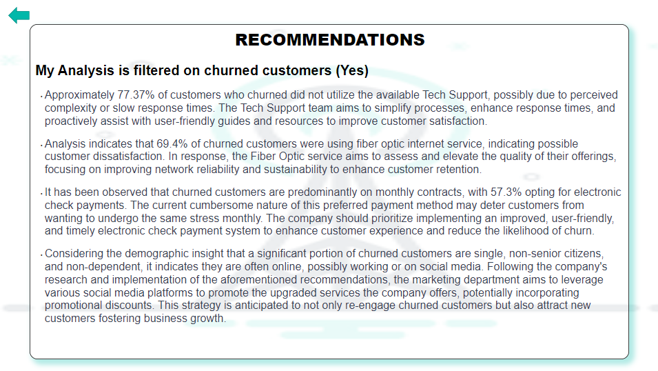

 #Telco Telecommunication Customer Churns
A telecommunication company named Telco is experiencing customers loss (churn customers). As a data analyst I am to come up with solutions or recommendations to solve the problem.

I utilized Microsoft Power BI to address the issue of customer churn. I specifically focused on churned customers, creating two key measures: one for identifying churned customers and another for calculating the churn rate, representing the percentage difference between churned customers and the total customer base. 

Through visualizations, I created a report pinpointing areas of concern and provided actionable recommendations to mitigate the problem and retain customers.

##Dashboard

##Recommendations

